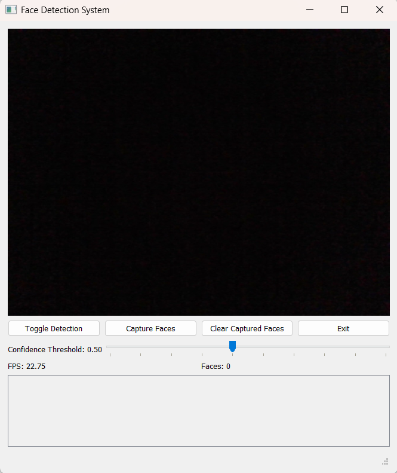

# Face Detection System (PyQt5 + Flask + OpenCV)


A real-time **Face Detection System** that works in two modes:  
1. 🖥️ **Desktop GUI** with PyQt5  
2. 🌐 **Web App** with Flask (deployable on Railway)  

The system uses **OpenCV’s DNN face detector** for accurate results, performs **age and gender prediction**, allows you to **capture faces**, and manage them inside a **gallery view**.

---

## ✨ Features
- 📸 Real-time face detection with bounding boxes  
- 🧑‍🤝‍🧑 Age & gender prediction using pre-trained models  
- ⚡ Adjustable confidence threshold  
- 💾 Capture faces into a local gallery  
- 🎮 Keyboard shortcuts (GUI mode):  
  - `C` → Capture face  
  - `Q` → Quit application  

---

## 🖼️ Demo

### Desktop (PyQt5)
  

### Web (Flask)
Deployed on Railway → [https://your-app-name.up.railway.app](https://your-app-name.up.railway.app) *(example link)*

---

## ⚙️ Installation (Desktop GUI)

Clone the repository and install dependencies:

```bash
git clone https://github.com/your-username/FaceDetectionSystem.git
cd FaceDetectionSystem
pip install -r requirements.txt
````

Run the desktop app:

```bash
python face_detection_gui.py
```

---

## 🌐 Run as Web App (Flask)

Install dependencies:

```bash
pip install -r requirements.txt
```

Run locally:

```bash
python app.py
```

Then open [http://localhost:5000](http://localhost:5000) in your browser.

### 🚀 Deploy on Railway

This repo includes a `Dockerfile` for deployment.
Push to GitHub and connect the repo to [Railway](https://railway.app/) for instant deployment.

---

## 📦 Build as Executable (Windows, Desktop)

To package into a `.exe` using **PyInstaller**:

```bash
pyinstaller --noconfirm --onefile --windowed ^
  --add-data "config.json;." ^
  --add-data "models;models" ^
  face_detection_gui.py
```

The built executable will be inside the `dist/` folder.

---

## 📂 Project Structure

```
FaceDetectionSystem/
│── app.py                     # Flask web app
│── face_detection_gui.py      # Desktop GUI application
│── config.json                # Config file (paths, settings)
│── models/                    # Pre-trained Caffe models
│── templates/                 # HTML templates (Flask)
│── requirements.txt           # Dependencies
│── Dockerfile                 # For Railway deployment
│── README.md                  # Documentation
│── .gitignore                 # Ignore build/venv/output
│── captured_faces/            # Saved face captures (auto-created)
│── dist/ / build/             # PyInstaller outputs (ignored)
```

---

## 👩‍💻 Tech Stack

* **Python 3.10 / 3.11**
* **OpenCV DNN**
* **Flask (for web app)**
* **PyQt5 (for desktop app)**
* **PyInstaller (for .exe builds)**
* **Gunicorn (for production deployment on Railway)**

---

## 🛠️ Future Improvements

* Train on custom datasets
* Add face recognition (match against known people)
* Export captured face metadata
* REST API for face detection (extend Flask mode)

---

## 📜 License

This project is licensed under the **MIT License**.
Feel free to use and modify it for learning or personal projects.

---

## 🙌 Author

Made by **Sagarika**
